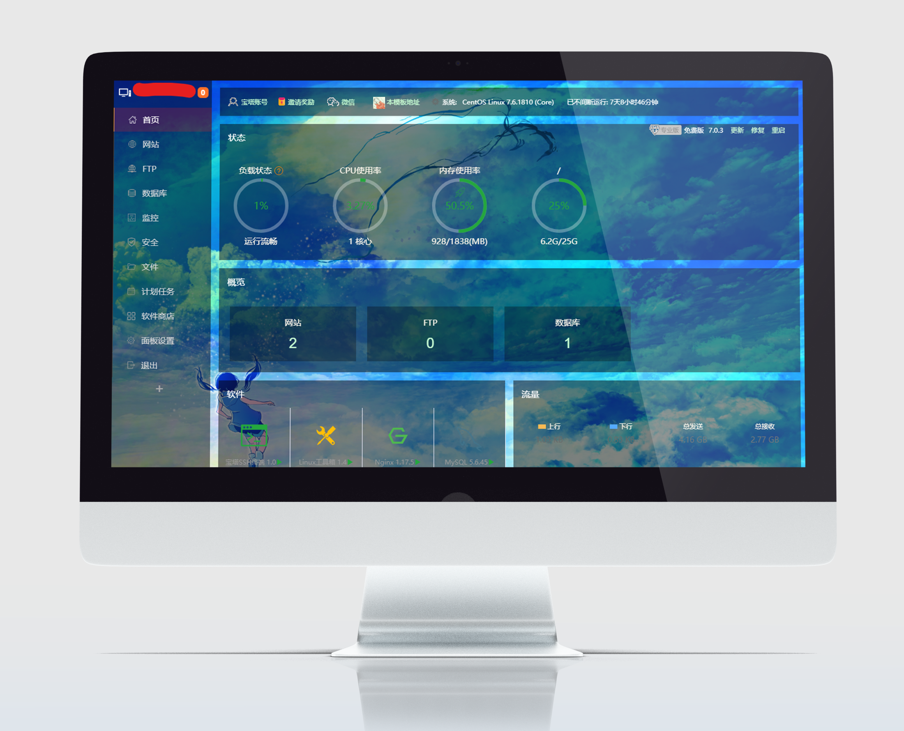
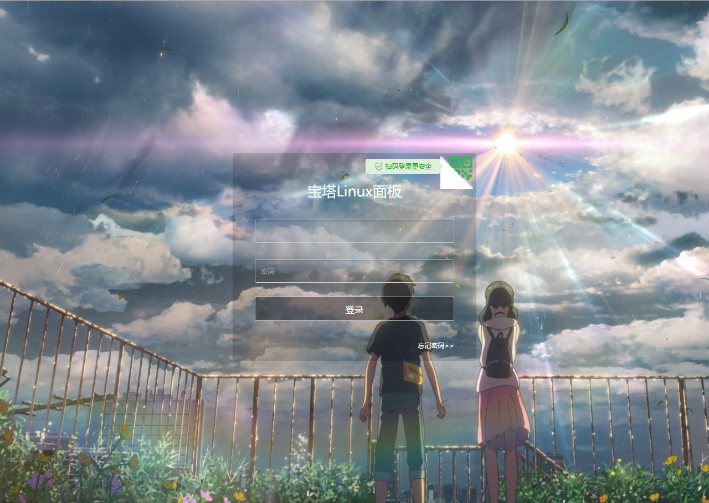

# BTPanel-DIY-Template
BTPanel-DIY-Template

    

# BTPanel-DIY-Template - Your BTPanel-DIY-Template

[小俊博客](https://www.www.xjisme.com/) &nbsp;

> 下载稳定版请点击[这里](https://github.com/laulzgoay/BTPanel-DIY-Template/releases)，发现 bug 可发送邮件至邮箱：laulzgoay@outlook.com，或提交 [issues](https://github.com/laulzgoay/BTPanel-DIY-Template/issues)  

主要特性
---
- 使用《天气之子》的高清大图作为宝塔面板图片背景（可在代码中自行更改）

安装需求
---
* 宝塔面板

安装教程
---
1. 下载BTPanel-DIY-Template，上传至 /www/server/panel/BTPanel/
2. 解压并覆盖到 /www/server/panel/BTPanel/
3. 进入服务器SSH，输入 bt ，输入 9 ，清空面板缓存
4. 刷新浏览器即可（ Ctrl + F5 ）

联系我
---
- Tg：@lauzlgoay
- Email: laulzgoay@outlook.com
- Blog：[https://www.xjisme.com/](https://www.xjisme.com)

